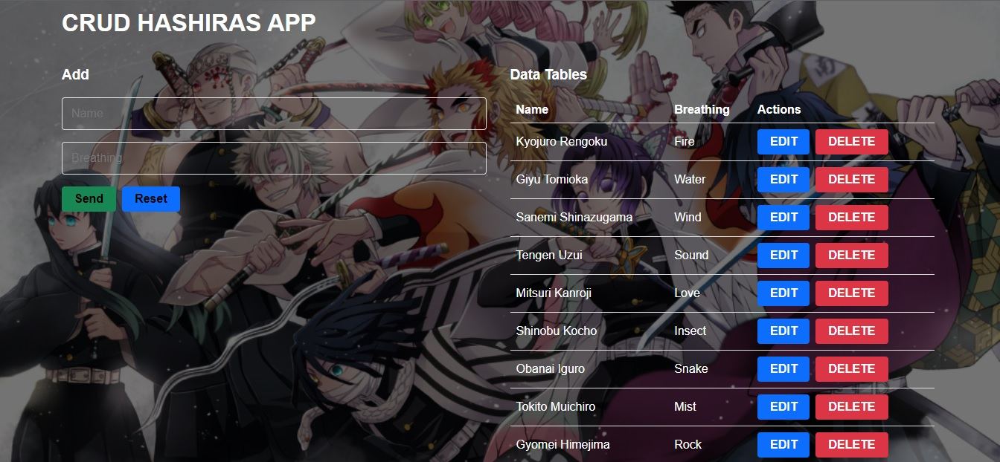
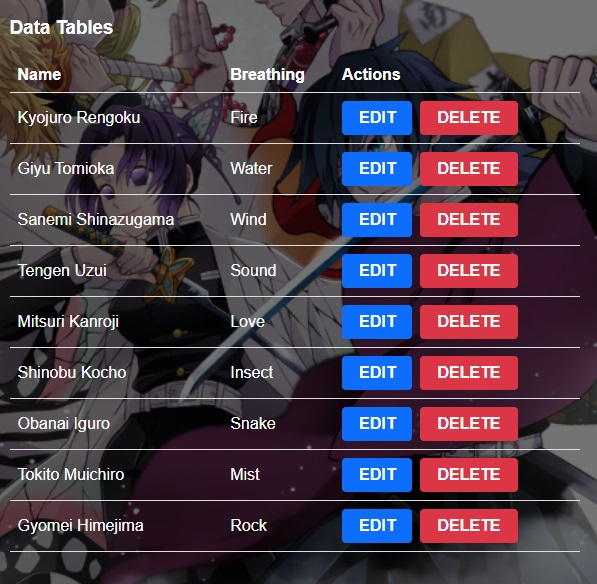

# CRUD-hashiras-v1

## Description
Crud with reference to the anime kimetsu no yaiba, I am using a false api, by means of an array. This demo performs the functions of adding, editing and deleting records.

## STACK
- HTML5
- CSS3
- JavaScript
- ReactJs

## Installation

Clone the project 

```bash
  git clone https://github.com/JesusLeonChavez/crud-hashiras-v1.git
```

Installation

```bash
  npm i
```

Start Client

```bash
  npm start
```

## Public Routes
Accessible Routes:

* Home



* Form


* Table



* Add Hashira


## References

1) jonmircha, link youtube: https://www.youtube.com/watch?v=wMrHnWvUREA&list=PLvq-jIkSeTUZ5XcUw8fJPTBKEHEKPMTKk&index=31
